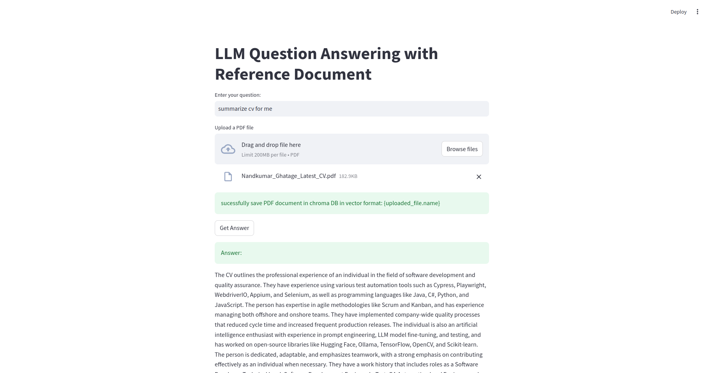

# AI-pdf-chat

This project allows you to interact with PDF files using a conversational interface. Built with LangChain and Hugging Face API, it enables natural language querying and interaction with PDF documents.

## Repository
**GitHub Repo:** [AI-pdf-chat](https://github.com/nand1234/AI-pdf-chat.git)

## Features
- Extract and process text from PDFs and store in chroma DB
- Query PDF content using natural language.
- Powered by LangChain and Hugging Face API for seamless interactions.

## Installation

1. Clone the repository:
    ```bash
    git clone https://github.com/nand1234/AI-pdf-chat.git
    cd AI-pdf-chat
    ```

2. Install Python dependencies:
    ```bash
    pip install -r requirements.txt
    ```

## Running the Application

1. Start the Streamlit application:
    ```bash
    streamlit run streamlit.py
    ```

2. Open the link provided in the terminal to interact with the application.

## Dependencies
Make sure you have Python 3.8 or above installed. The required Python libraries are listed in `requirements.txt`.

## Contributing
Feel free to submit issues or pull requests for improvements and bug fixes.

---

Enjoy chatting with your PDF files!

